# Resolución de Reto OSINT - Atención Extorsión de TheHackersLabs

## Web

Encuentrarás toda la información de este reto en la siguiente URL:

https://thehackerslabs.com/atencion-extorsion/

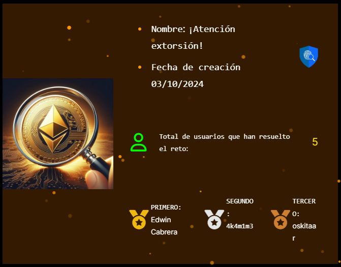

## Análisis de Informe

Revisemos por partes el informe proporcionado.

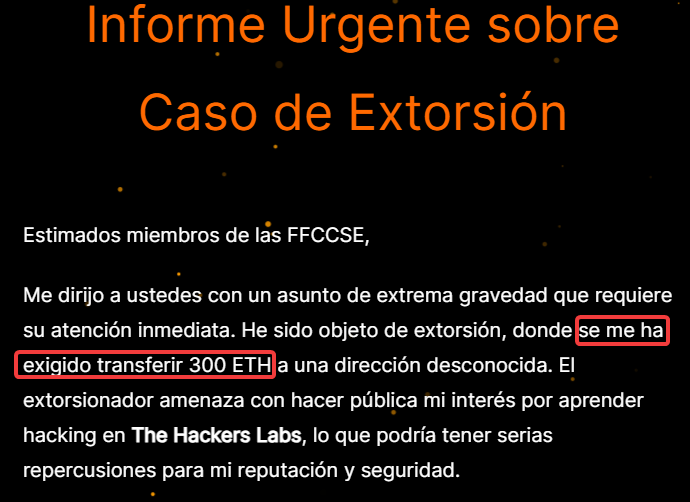

Un dato relevante es el monto exigido: 300 ETH (Ethers o Etherium)

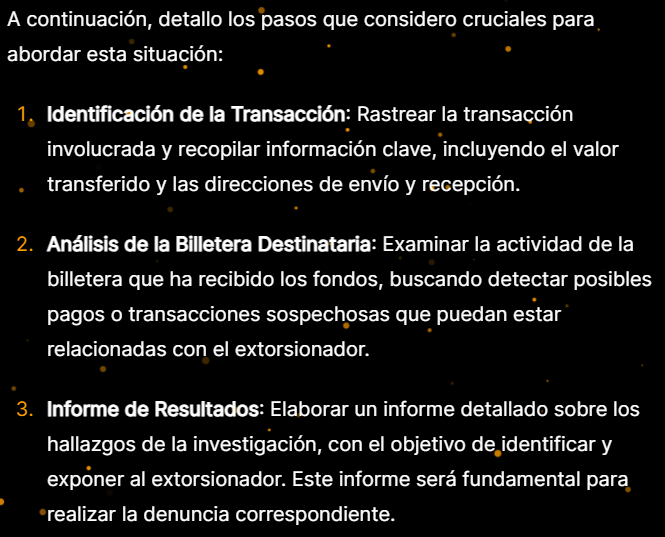

En esta parte son más que todo consejos para realizar OSINT (Open Source Intelligence: Recopilación y análisis de información disponible públicamente)

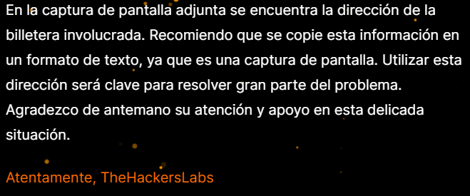
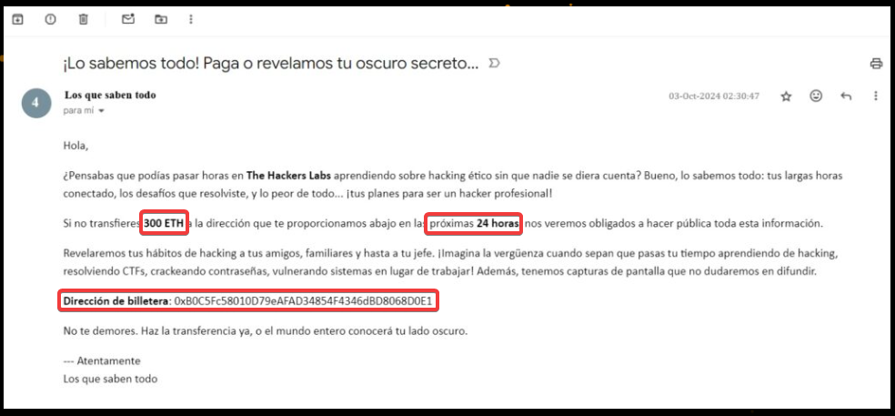

Y luego tenemos una imagen adjuntada, que proporciona datos importantes:

Datos:

Fecha y Hora amenaza: 03-10-24 02:30:47
Fecha límite para pagar: 04-10-24 02:30:47 (Ya que hay un límite de 24 horas para pagar)

Remitente: Los que saben todo
Monto pedido: 300 ETH (este dato ya lo conocíamos)

Dirección de billetera: 0xB0C5Fc58010D79eAFAD34854F4346dBD8068D0E1

## Preguntas

Para retos como este es importante saber las preguntas que necesitamos responder y no irnos por las ramas.

Dicho esto listemos las preguntas de la plataforma de la siguiente manera:

- Debes estar logueado
- Click en Cuestionario -> Inicio
  
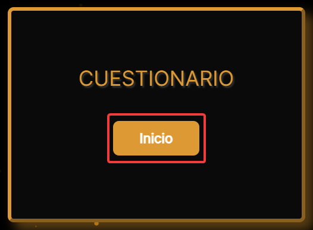

- Podemos observar todas las preguntas y que cada una de ellas tiene un botón de comprobar.

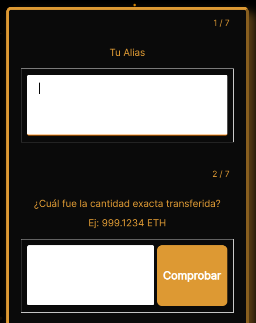
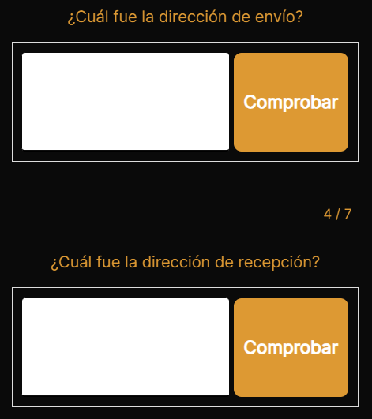
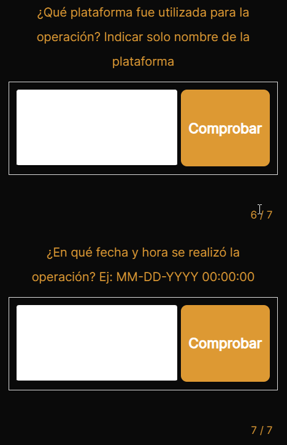
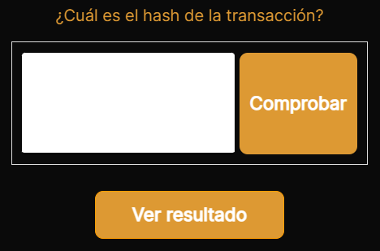

Ahora sí podemos empezar con la recopilación de información pública.

## Etherscan

Etherscan es un explorador de bloques para la blockchain de Ethereum. Permite a los usuarios ver y buscar información pública sobre transacciones, contratos inteligentes, direcciones de billeteras y más.
Usaremos esta herramiente online, su url es la siguiente:

https://etherscan.io/

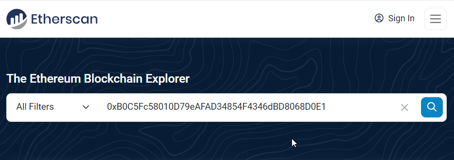

Una vez en Etherscan, ingresamos en su buscador la dirección de billetera que tenemos como dato.

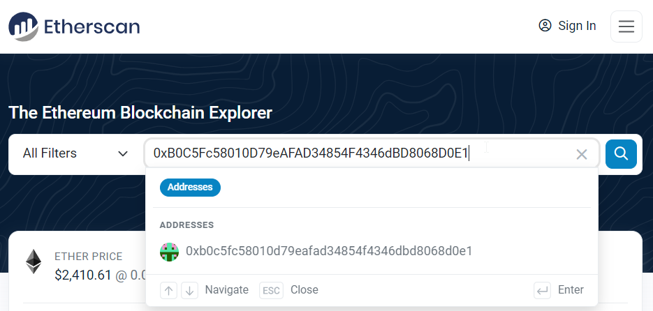

Y obtenemos información de esa dirección.

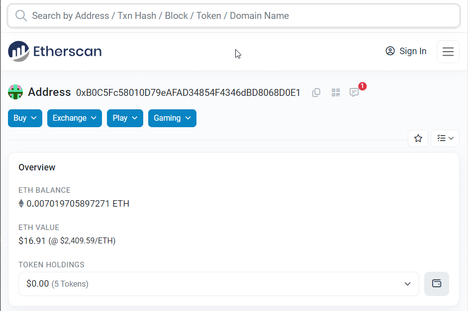

Si nos desplazamos hasta abajo, podremos encontrar la sección de transferencias. Y podemos filtrar por "View Incoming Txns" para ver solo las transacciones que han ingresado a esta dirección.

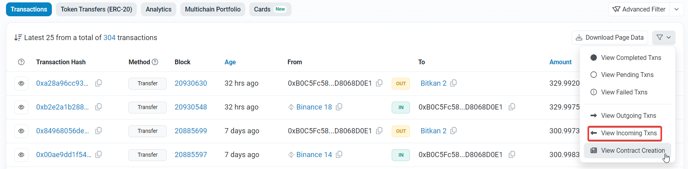

Podemos observar que existe solo una transacción que se encuentra entre la fecha de la amenaza (03-10-24 02:30:47) y la fecha límite para pagar la extorsión (04-10-24 02:30:47)

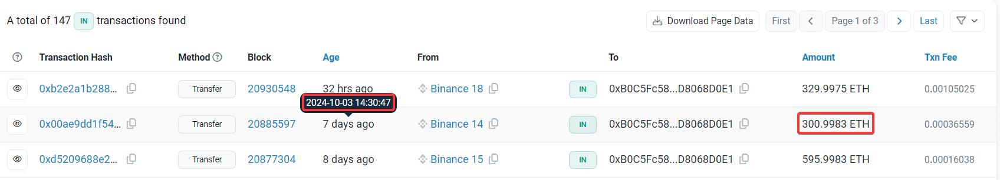

Ingresamos al hash de la transacción para ver mayor detalle y encontrar todas las respuestas a las preguntas que anotamos. 

## Respuestas

### Cantidad exacta transferida
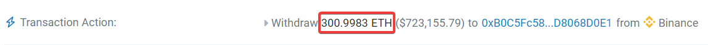

### Dirección de envío
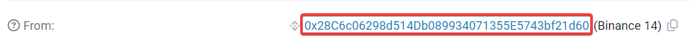

### Dirección de recepción
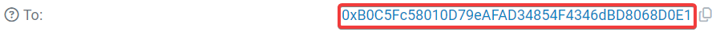

### Plataforma usada para la operación
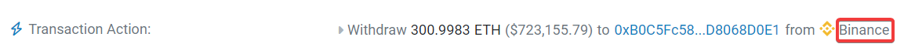

### Fecha y hora de la operación
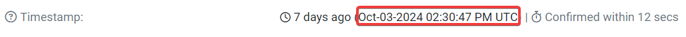

### Hash de la transacción
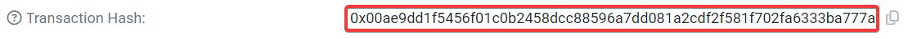

Con esto tendríamos todas las respuesta y solo quedaría ingresarlas, comprobarlas y enviarlas.

## Comprobación fallida

### Formato de fecha incorrecto

Algo de lo que me pude dar cuenta es que el formato que pide la plataforma es MM-DD-YYYY 00:00:00 pero al colocar 10-03-2024 14:30:47 (poco más de las 2 de la tarde)
según el formato establecido de 24 Horas y comprobarlo, se puede ver que no es correcto para plataforma a pesar de respetar el formato pedido.

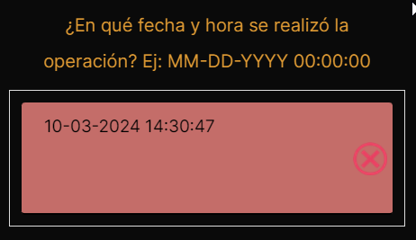

Después de varios intentos, el formato que acepta es Oct-03-2024 02:30:47 (poco más de las 2 de la mañana)

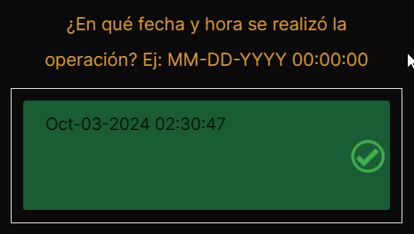

Observando un poco nuestros datos, más allá de que la respuesta tampoco respeta el formato del mes, la hora no tiene sentido, porque la fecha y hora en la que el 
extorsionador envía el mensaje a la víctima es a las 03-10-24 02:30:47 según la imagen proporcionada.
No es posible que al mismo tiempo la víctima haya pagado el monto solicitado. Así que la respuesta lógica de cuándo se hizo la transacción es 10-03-2024 14:30:47.

Estos son detalles que se deben tener en cuenta si te estás animando a ser un Analista Forense Digital.

## Caso alternativo

Tuvimos suerte de encontrar solo una sola transacción en el rango especificado de tiempo límite para realizar el pago a la dirección especificada y con un monto cercano pero no igual al solicitado.
Qué hubiera pasado si había más de una transacción en dicho rango de tiempo?

En la vida real, esto se hubiera resuelto con una entrevista a la víctima durante la Fase de Investigación del Análisis Forense. Aquí en la plataforma no podemos hacerlo,
así que tenemos que optar por aprovechar todo lo que nos den, así que procedemos a analizar la imagen que se nos dio. Repito, esto es irreal, por sentido común no vas a analizar una imagen que 
ha capturado la misma víctima, pero para fines educativos y de la plataforma, sirve analizar todo.

### Exiftool

Es una herramienta que permite leer, escribir y editar metadatos en una amplia variedad de archivos, incluyendo imágenes, audio y vídeo.

Descargamos la imagen proporcionada con el nombre que deseemos, en mi caso "extorsion.jgp".

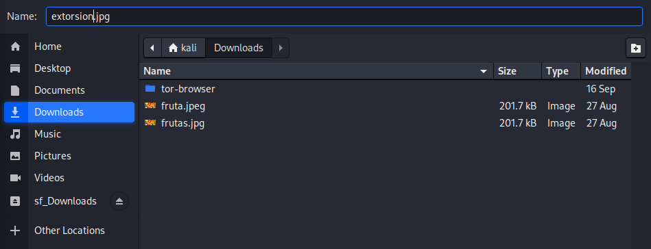

La analizamos con el siguiente comando:

```bash
exiftool ~/Downloads/extorsion.jpg 
```
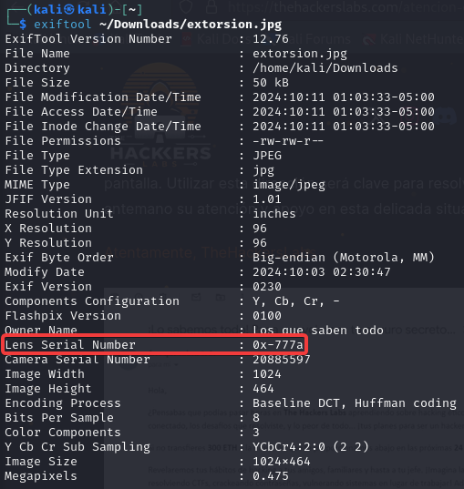

Podemos visualizar un dato importante que es "Lens Serial Number: : 0x-777a" que por el formato parece ser un hash que solo muestra sus 2 primeros y 4 últimos dígitos. Recordemos que estamos asumiendo el caso
en que hay muchas transacciones y usamos este hash para hacer match con la transacción correcta. Esencialmente buscaremos un hash de transacción que cuente con estas características para llegar a la
transacción que realizó la víctima.

Happy Hacking!!!
